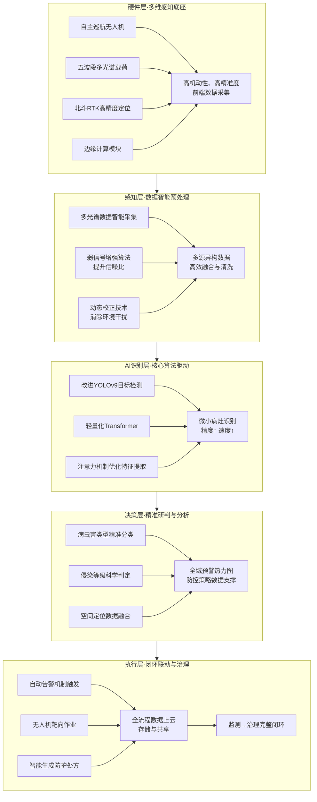

# 项目总体技术架构图

```mermaid
flowchart TD
    A[硬件层<br>多维感知底座] --> B[感知层<br>数据智能预处理]
    B --> C[AI识别层<br>核心算法驱动]
    C --> D[决策层<br>精准研判与分析]
    D --> E[执行层<br>闭环联动与治理]

    subgraph A[硬件层·多维感知底座]
        A1[自主巡航无人机] --> A5[高机动性、高精准度<br>前端数据采集]
        A2[五波段多光谱载荷] --> A5
        A3[北斗RTK高精度定位] --> A5
        A4[边缘计算模块] --> A5
    end

    subgraph B[感知层·数据智能预处理]
        B1[多光谱数据智能采集] --> B4[多源异构数据<br>高效融合与清洗]
        B2[弱信号增强算法<br>提升信噪比] --> B4
        B3[动态校正技术<br>消除环境干扰] --> B4
    end

    subgraph C[AI识别层·核心算法驱动]
        C1[改进YOLOv9目标检测] --> C4[微小病灶识别<br>精度↑ 速度↑]
        C2[轻量化Transformer] --> C4
        C3[注意力机制优化特征提取] --> C4
    end

    subgraph D[决策层·精准研判与分析]
        D1[病虫害类型精准分类] --> D4[全域预警热力图<br>防控策略数据支撑]
        D2[侵染等级科学判定] --> D4
        D3[空间定位数据融合] --> D4
    end

    subgraph E[执行层·闭环联动与治理]
        E1[自动告警机制触发] --> E4[全流程数据上云<br>存储与共享]
        E2[无人机靶向作业] --> E4
        E3[智能生成防护处方] --> E4
        E4 --> E5[监测→治理完整闭环]
    end
```
